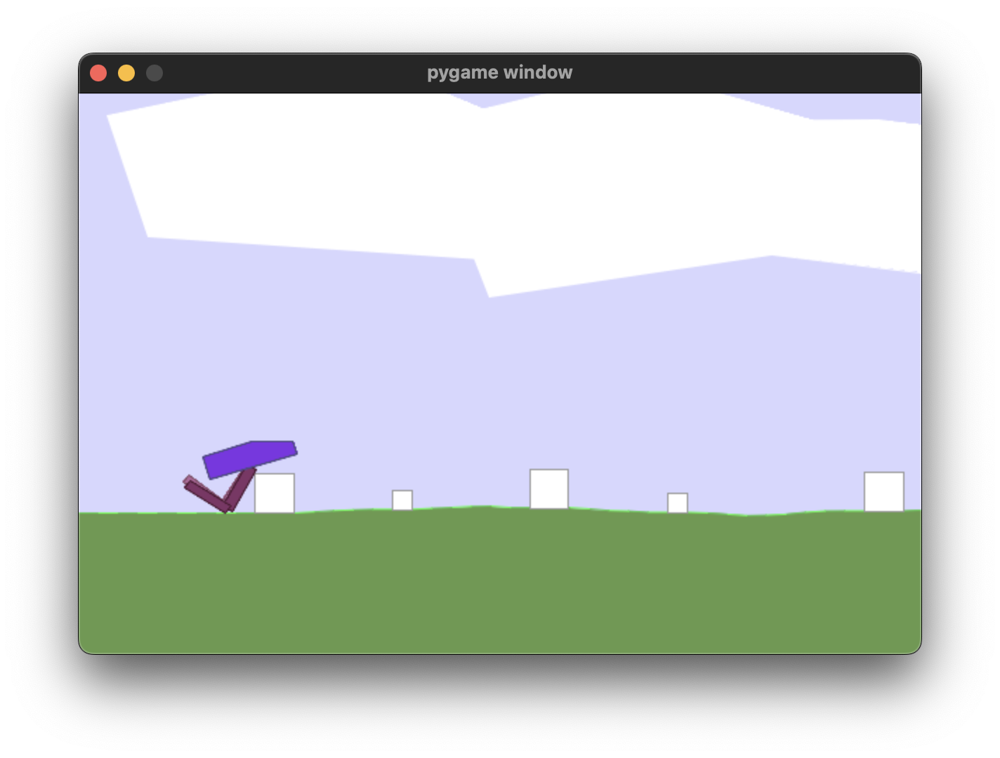

# DDPG Tutorial
This is the code from
[Reinforcement Learning in Continuous Action Spaces | DDPG Tutorial (Pytorch)](https://www.youtube.com/watch?v=6Yd5WnYls_Y)
by
[Machine Learning with Phil](https://www.youtube.com/@MachineLearningwithPhil).

Don't ask me why, but I typed all the code myself, following along with Phil's
video. I made a few adjustments here and there, but it is 99% Phil's code. For
comparison, here is
[Phil's actual code](https://github.com/philtabor/Youtube-Code-Repository/blob/master/ReinforcementLearning/PolicyGradient/DDPG/pytorch/lunar-lander/ddpg_torch.py),
which I did use to fix some typos I made.

Special thanks to Phil for personally helping me fix some bugs in my code.

---
## What I Learned

The intention of this project was to learn more about how DDPG works and how to
implement and apply it. That, I did learn.

I also learned that the difficulty in applying DDPG is in getting it to train in
a stable manner. I used Phil's hyperparameters, but next time I should really
perform grid searches on them to identify more stable sets.

The lunar lander project showed me the dangers of having edge cases. Watching
the game play, it is quite clear that the lander performs really well on most
cases, but when it gets low and to the left or right of its landing spot, it
just kind'a gives up. To me, this illustrates how important it is to have
training data for all cases. It also illustrates de danger of using a reward
graph over multiple episodes as a measure of success. The failures are masked by
the great performance in happy cases.

The walker project was all about local optima versus the global optimum.
Training the walker out of a local optimum is really difficult. The problem is
that you'd have to reward worse performance for the purpose of training the
local optimum out. In real life we do that. When a team member learns a new
programming language, we accept that they are less productive during that time.
Only through more experimentation can the walker crawl out of the local optimum
(if you'll pardon the pun).

---
## Getting Started

Initially, I wanted to make this code into a Jupyter notebook running in Docker,
but that was made difficult by lack of support. OpenAI's gym environment needs a
lot of system-level dependencies installed and I don't like polluting my
development system with dependencies like this. However, Docker does not give
good access to the GPU on my Macbook Air M2, plus rendering gyms is easier
without virtualisation and remoting. Thus, this project comes with a virtual
environment and is intended to be run on bare metal.

### Setting up the Environment
Assuming you are on Mac OS X:

```bash
$ brew install swig
$ python3 -m venv venv
$ source venv/bin/activate
(venv) $ pip install -r requirements.txt
```

### Training the Model
This model runs at about 10 seconds per episode, after 1000 generations, on my
Macbook Air M2. Checkpoints are saved in a directory named `checkpoints` and the
model training will try to load previous checkpoints before starting to train.

```bash
(venv) $ python torch_lunar_lander.py
```

And to train the walker:

```bash
(venv) $ python torch_walker.py
```

### Seeing the Trained Model
Training is headless, so after (or even during) training, you may want to see
the model controlling the lunar lander. To do so, start the command below. That
loads the models from the `checkpoints` and runs the game with visuals enabled.

```bash
(venv) $ python visual_torch_lunar_lander.py
```

And to see the walker:

```bash
(venv) $ python visual_torch_walker.py
```

---
## Optimizations
This section lists a few changes from Phil's original code that may affect
behaviour or learning. There are other changes, but those are syntactical.

### Seeded Random
In his video's Phil is quite clear that he expects the best results with a
seeded random generation. I ended up not using a seeded generator and just train
for longer. In my opinion, the seeded random just hides the fact that model
training is quite unstable. Sometimes it just fails to converge and you have to
restart the training completely.

### Lunar Lander: Hover Behaviour
One of the problems that we ran into is that the models learn to hover to avoid
the punishment of crashing. It found a local optimum in just running the engines
until the gym times out after 1000 iterations. This behaviour will train out
given enough training cycles (I trained for 10.000 cycles to get good results).

I also experimented with punishing the hover behaviour by subtracting the number
of iterations used from the reward. This pushed training in the right direction,
but is not necessary.

### Lunar Lander: Wind and No Wind
I trained the model twice with different settings: once without wind and once
with wind. Their reward graphs over 30.000 episodes are shown below; left
without wind and right with wind.

<p align="center" width="100%">
    
    
</p>

It is dangerous to draw conclusions from a single training session, but it
_seems_ that the training with wind results in more robust behaviour. Perhaps
the extra distrurbance gives the model more situations to train with, improving
generalisation? Again, training this model is quite unstable and it may have
just been a fluke.

### Bipedal Walker: Sitting Down
After a while, the bipedal walker learns to sit down and wait out the episode.
My hunch is that this is due to the size of the replay buffer. At 1600 records
per episode and a capacity of 1.000.000 in the replay buffer, it only takes a
few hundred episodes for the entire replay buffer to be overwritten. Once the
sitting behaviour starts dominating, this swamps out any other items in the
replay buffer.

The image below shows the learning curve where the walker learned to just sit
and wait for the episode to end. Notice how the curve just flattens at the end.
Training was cut short for this run, because the behaviour causes training to
slow down to a crawl.

<p align="center" width="100%">
    
</p>

Making the giant assumtion that this is what is happening, there are two ways
forward: change the reward structure or change the replay buffer.

The simplest change is to use a larger replay buffer, but after some
experimentation that does not make much difference. Below is the training graph
where we used a 10.000.000 element replay buffer. Such a large replay buffer can
hold the information on 6500 episodes, where the default size could only hold
about 650 elements. This run also ended with the walker sitting down to wait out
the games, and I cut it short.

<p align="center" width="100%">
    
</p>

Another option is to change the reward. We might give the agent a (say) 200
point penalty if the game times out. That will make sitting down less rewarding
than falling on its face. Both give a reward of approximately -130 points. In
fact, the reward for sitting down and timing out is about the same as the reward
for falling over immediately. The former is a dead-end, while the latter opens
the door to learning. The further the walker gets before falling over, the more
points it gets. Sitting down offers no such avenue.

### Bipedal Walker: Hardcore Training, Sitting Down

After training the basic walker, I enabled hardcore mode on the walker's
environment. This puts blocks and pits into the walker's path. After 30.000
episodes I stopped training, though there was still marginal improvement over
time.

<p align="center" width="100%">
    
</p>

That training graph shows how the model was training slowly up, even as I
stopped the training. the image below shows how the walker dealt with the
barrier blocks: just lean up against them and wait out the episode.

<p align="center" width="100%">
    
</p>

---

